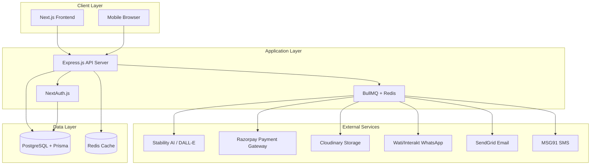
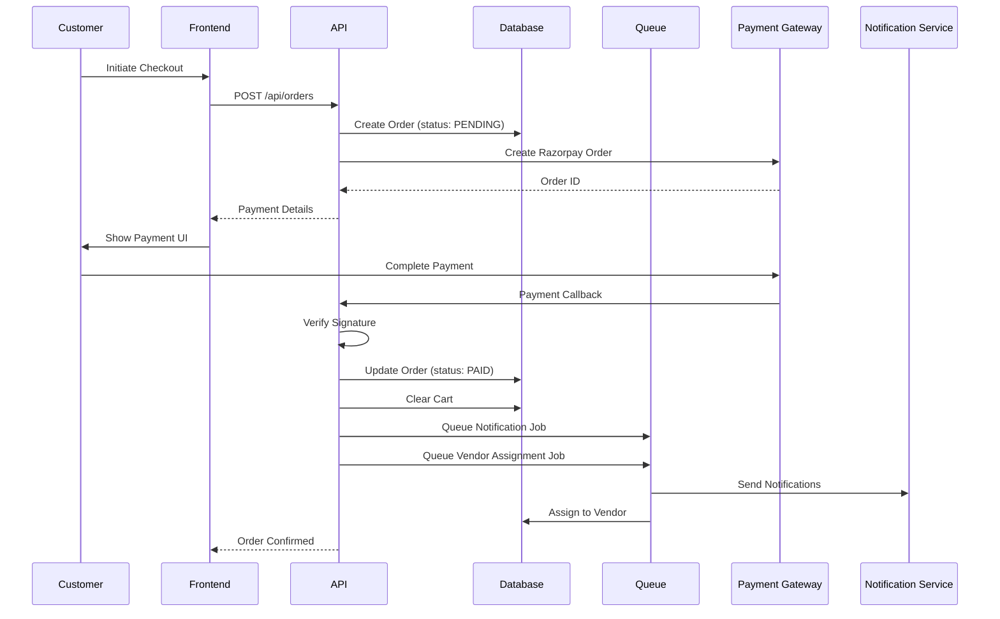
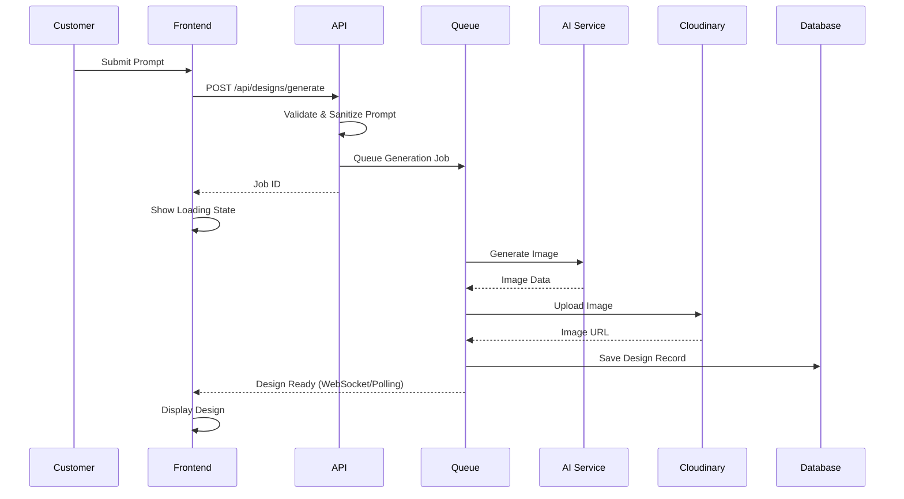
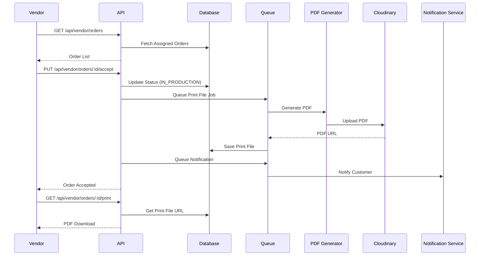

# Design Document: PrintAI Platform

## Overview

PrintAI is a full-stack AI-powered print-on-demand platform built with Next.js 14, Node.js/Express, and PostgreSQL. The system enables customers to generate custom T-shirt designs using AI, configure products, place orders with integrated payment processing, and have orders fulfilled by registered vendors.

The platform consists of three primary interfaces:
- **Customer Storefront**: Public-facing Next.js application for design creation and ordering
- **Vendor Portal**: Authenticated interface for order fulfillment management
- **Admin Panel**: Comprehensive dashboard for platform operations and analytics

### Key Design Principles

1. **Separation of Concerns**: Clear boundaries between frontend, backend API, and external services
2. **Asynchronous Processing**: Long-running tasks (AI generation, notifications, PDF creation) handled via job queues
3. **Scalability**: Stateless API design with horizontal scaling capability
4. **Security**: Defense-in-depth with authentication, authorization, input validation, and encryption
5. **Reliability**: Retry mechanisms, graceful degradation, and comprehensive error handling

## Architecture

### High-Level System Architecture



### Component Architecture

**Frontend (Next.js 14)**
- App Router with server and client components
- Server-side rendering for SEO and performance
- Client components for interactive features (design editor, cart)
- Tailwind CSS for responsive styling
- NextAuth.js for authentication flows

**Backend (Node.js + Express.js)**
- RESTful API with JWT authentication
- Middleware: authentication, validation, rate limiting, error handling
- Service layer for business logic
- Repository pattern for data access via Prisma

**Job Queue (BullMQ + Redis)**
- Asynchronous processing for AI generation, notifications, PDF creation
- Retry logic with exponential backoff
- Job prioritization and concurrency control
- Dead letter queue for failed jobs

**Database (PostgreSQL + Prisma)**
- Relational data model with referential integrity
- Transactions for critical operations
- Indexes for query optimization
- Audit trails for order status changes

## Components and Interfaces

### Frontend Components

**Customer Interface**
- `AuthFlow`: Registration/login with email, Google OAuth, mobile OTP
- `DesignStudio`: AI prompt input, pre-prompt gallery, design generation
- `ProductConfigurator`: Fabric, GSM, size, color selection with price updates
- `MockupPreview`: Real-time product visualization with design overlay
- `ShoppingCart`: Multi-item cart with quantity management
- `CheckoutFlow`: Address collection, payment integration, order confirmation
- `OrderTracking`: Order history and real-time status updates
- `NotificationPreferences`: Multi-channel notification settings

**Vendor Interface**
- `VendorDashboard`: Assigned orders overview
- `OrderDetails`: Design preview, specifications, customer info
- `OrderActions`: Accept/reject, status updates, tracking info input
- `PrintFileDownload`: PDF download for production

**Admin Interface**
- `AdminDashboard`: Analytics, metrics, KPIs
- `OrderManagement`: All orders with filtering, search, manual actions
- `VendorManagement`: Vendor registration, activation, capacity settings
- `CatalogManagement`: Product options, pricing configuration
- `AnalyticsReports`: Revenue, conversion, vendor performance
- `NotificationLogs`: Delivery status across all channels
- `AuditLogs`: Admin action history

### Backend Services

**AuthService**
- User registration with email verification
- Login with email/password, Google OAuth, mobile OTP
- JWT token generation and validation
- Role-based access control (Customer, Vendor, Admin)
- Session management

**DesignService**
- AI prompt validation and sanitization
- Integration with Stability AI SDXL or DALL-E 3
- Image upload to Cloudinary
- Design metadata storage
- Pre-prompt gallery management

**ProductService**
- Product catalog retrieval
- Configuration validation
- Price calculation based on options
- Availability checking
- Mockup generation coordination

**CartService**
- Cart item management (add, update, remove)
- Cart persistence for authenticated users
- Price calculation and validation
- Checkout preparation

**OrderService**
- Order creation from cart
- Order status management (Pending, Paid, Assigned, In Production, Shipped, Delivered, Cancelled)
- Order history retrieval
- Manual order actions (reassignment, cancellation)
- Estimated delivery calculation

**PaymentService**
- Razorpay order creation
- Payment callback handling with signature verification
- Payment status tracking
- Refund processing
- Transaction logging

**VendorService**
- Vendor registration and profile management
- Vendor activation/deactivation
- Capacity management
- Performance metrics calculation
- Order assignment logic

**NotificationService**
- Multi-channel notification dispatch (WhatsApp, Email, SMS)
- Template management
- Retry logic with exponential backoff
- Delivery status tracking
- Notification history

**PrintFileService**
- PDF generation using Puppeteer
- Design embedding at 300 DPI
- CMYK color conversion
- Bleed and crop mark inclusion
- Print specification validation
- File upload to Cloudinary

**AnalyticsService**
- Metrics aggregation (orders, revenue, conversion)
- Vendor performance calculation
- Customer analytics
- Date range filtering
- Report generation

### API Endpoints

**Authentication Endpoints**
```
POST   /api/auth/register              - Customer registration
POST   /api/auth/login                 - Email/password login
POST   /api/auth/google                - Google OAuth callback
POST   /api/auth/otp/send              - Send mobile OTP
POST   /api/auth/otp/verify            - Verify mobile OTP
POST   /api/auth/logout                - Logout
GET    /api/auth/session               - Get current session
```

**Design Endpoints**
```
POST   /api/designs/generate           - Generate AI design
GET    /api/designs/pre-prompts        - Get pre-prompt gallery
GET    /api/designs/:id                - Get design details
DELETE /api/designs/:id                - Delete design
```

**Product Endpoints**
```
GET    /api/products/catalog           - Get product catalog
GET    /api/products/options           - Get configuration options
POST   /api/products/price             - Calculate price for configuration
POST   /api/products/mockup            - Generate mockup preview
```

**Cart Endpoints**
```
GET    /api/cart                       - Get current cart
POST   /api/cart/items                 - Add item to cart
PUT    /api/cart/items/:id             - Update cart item
DELETE /api/cart/items/:id             - Remove cart item
DELETE /api/cart                       - Clear cart
```

**Order Endpoints**
```
POST   /api/orders                     - Create order from cart
GET    /api/orders                     - Get order history
GET    /api/orders/:id                 - Get order details
PUT    /api/orders/:id/cancel          - Cancel order
```

**Payment Endpoints**
```
POST   /api/payments/create            - Create Razorpay order
POST   /api/payments/verify            - Verify payment callback
POST   /api/payments/refund            - Process refund
```

**Vendor Endpoints**
```
GET    /api/vendor/orders              - Get assigned orders
PUT    /api/vendor/orders/:id/accept   - Accept order
PUT    /api/vendor/orders/:id/reject   - Reject order
PUT    /api/vendor/orders/:id/status   - Update order status
GET    /api/vendor/orders/:id/print    - Download print file
```

**Admin Endpoints**
```
GET    /api/admin/orders               - Get all orders with filters
PUT    /api/admin/orders/:id/reassign  - Reassign order to vendor
PUT    /api/admin/orders/:id/status    - Override order status
POST   /api/admin/vendors              - Register new vendor
PUT    /api/admin/vendors/:id          - Update vendor details
PUT    /api/admin/vendors/:id/activate - Activate/deactivate vendor
GET    /api/admin/vendors              - Get all vendors
GET    /api/admin/analytics            - Get analytics data
GET    /api/admin/notifications/:orderId - Get notification history
POST   /api/admin/catalog/fabrics      - Add fabric type
PUT    /api/admin/catalog/fabrics/:id  - Update fabric type
POST   /api/admin/catalog/pricing      - Update pricing rules
```

## Data Models

### Database Schema

**User**
```prisma
model User {
  id            String    @id @default(uuid())
  email         String?   @unique
  emailVerified DateTime?
  mobile        String?   @unique
  password      String?
  name          String?
  role          Role      @default(CUSTOMER)
  googleId      String?   @unique
  createdAt     DateTime  @default(now())
  updatedAt     DateTime  @updatedAt
  deletedAt     DateTime?
  
  orders        Order[]
  designs       Design[]
  cart          CartItem[]
  sessions      Session[]
}

enum Role {
  CUSTOMER
  VENDOR
  ADMIN
  SUPER_ADMIN
}
```

**Vendor**
```prisma
model Vendor {
  id              String    @id @default(uuid())
  userId          String    @unique
  user            User      @relation(fields: [userId], references: [id])
  businessName    String
  location        String
  capacity        Int       @default(10)
  priority        Int       @default(1)
  isActive        Boolean   @default(true)
  acceptanceRate  Float     @default(0)
  avgFulfillment  Float?
  createdAt       DateTime  @default(now())
  updatedAt       DateTime  @updatedAt
  
  orders          Order[]
}
```

**Design**
```prisma
model Design {
  id          String    @id @default(uuid())
  userId      String
  user        User      @relation(fields: [userId], references: [id])
  prompt      String
  imageUrl    String
  cloudinaryId String
  aspectRatio String
  aiProvider  String    // "stability" or "dalle"
  createdAt   DateTime  @default(now())
  
  orderItems  OrderItem[]
}
```

**PrePrompt**
```prisma
model PrePrompt {
  id          String   @id @default(uuid())
  title       String
  prompt      String
  category    String
  previewUrl  String
  isActive    Boolean  @default(true)
  sortOrder   Int      @default(0)
  createdAt   DateTime @default(now())
}
```

**Product Configuration**
```prisma
model Fabric {
  id          String   @id @default(uuid())
  name        String   @unique
  priceModifier Float  @default(0)
  isActive    Boolean  @default(true)
  
  orderItems  OrderItem[]
}

model GSM {
  id          String   @id @default(uuid())
  value       Int      @unique
  priceModifier Float  @default(0)
  isActive    Boolean  @default(true)
  
  orderItems  OrderItem[]
}

model Size {
  id          String   @id @default(uuid())
  name        String   @unique
  priceModifier Float  @default(0)
  isActive    Boolean  @default(true)
  
  orderItems  OrderItem[]
}

model Color {
  id          String   @id @default(uuid())
  name        String   @unique
  hexCode     String
  priceModifier Float  @default(0)
  isActive    Boolean  @default(true)
  
  orderItems  OrderItem[]
}

model Pricing {
  id          String   @id @default(uuid())
  basePrice   Float
  effectiveFrom DateTime @default(now())
  isActive    Boolean  @default(true)
}
```

**Cart**
```prisma
model CartItem {
  id          String   @id @default(uuid())
  userId      String
  user        User     @relation(fields: [userId], references: [id])
  designId    String
  design      Design   @relation(fields: [designId], references: [id])
  fabricId    String
  fabric      Fabric   @relation(fields: [fabricId], references: [id])
  gsmId       String
  gsm         GSM      @relation(fields: [gsmId], references: [id])
  sizeId      String
  size        Size     @relation(fields: [sizeId], references: [id])
  colorId     String
  color       Color    @relation(fields: [colorId], references: [id])
  quantity    Int      @default(1)
  price       Float
  createdAt   DateTime @default(now())
  updatedAt   DateTime @updatedAt
  
  @@unique([userId, designId, fabricId, gsmId, sizeId, colorId])
}
```

**Order**
```prisma
model Order {
  id              String      @id @default(uuid())
  orderNumber     String      @unique
  userId          String
  user            User        @relation(fields: [userId], references: [id])
  vendorId        String?
  vendor          Vendor?     @relation(fields: [vendorId], references: [id])
  status          OrderStatus @default(PENDING)
  totalAmount     Float
  paymentId       String?
  paymentStatus   PaymentStatus @default(PENDING)
  shippingAddress Json
  trackingNumber  String?
  estimatedDelivery DateTime?
  createdAt       DateTime    @default(now())
  updatedAt       DateTime    @updatedAt
  
  items           OrderItem[]
  statusHistory   OrderStatusHistory[]
  notifications   Notification[]
  printFile       PrintFile?
}

enum OrderStatus {
  PENDING
  PAID
  ASSIGNED
  IN_PRODUCTION
  SHIPPED
  DELIVERED
  CANCELLED
}

enum PaymentStatus {
  PENDING
  SUCCESS
  FAILED
  REFUNDED
}
```

**OrderItem**
```prisma
model OrderItem {
  id          String   @id @default(uuid())
  orderId     String
  order       Order    @relation(fields: [orderId], references: [id])
  designId    String
  design      Design   @relation(fields: [designId], references: [id])
  fabricId    String
  fabric      Fabric   @relation(fields: [fabricId], references: [id])
  gsmId       String
  gsm         GSM      @relation(fields: [gsmId], references: [id])
  sizeId      String
  size        Size     @relation(fields: [sizeId], references: [id])
  colorId     String
  color       Color    @relation(fields: [colorId], references: [id])
  quantity    Int
  price       Float
  createdAt   DateTime @default(now())
}
```

**PrintFile**
```prisma
model PrintFile {
  id            String   @id @default(uuid())
  orderId       String   @unique
  order         Order    @relation(fields: [orderId], references: [id])
  fileUrl       String
  cloudinaryId  String
  resolution    Int      // DPI
  colorSpace    String   // "CMYK"
  createdAt     DateTime @default(now())
}
```

**OrderStatusHistory**
```prisma
model OrderStatusHistory {
  id          String      @id @default(uuid())
  orderId     String
  order       Order       @relation(fields: [orderId], references: [id])
  status      OrderStatus
  changedBy   String?     // userId or "system"
  notes       String?
  createdAt   DateTime    @default(now())
}
```

**Notification**
```prisma
model Notification {
  id          String            @id @default(uuid())
  orderId     String
  order       Order             @relation(fields: [orderId], references: [id])
  channel     NotificationChannel
  type        NotificationType
  recipient   String            // email, phone, or whatsapp number
  status      NotificationStatus
  attempts    Int               @default(0)
  lastAttempt DateTime?
  errorMessage String?
  sentAt      DateTime?
  createdAt   DateTime          @default(now())
}

enum NotificationChannel {
  EMAIL
  SMS
  WHATSAPP
}

enum NotificationType {
  ORDER_CONFIRMATION
  ORDER_ASSIGNED
  ORDER_IN_PRODUCTION
  ORDER_SHIPPED
  ORDER_DELIVERED
  ORDER_CANCELLED
}

enum NotificationStatus {
  PENDING
  SENT
  FAILED
  RETRYING
}
```

**Session**
```prisma
model Session {
  id           String   @id @default(uuid())
  userId       String
  user         User     @relation(fields: [userId], references: [id])
  token        String   @unique
  expiresAt    DateTime
  createdAt    DateTime @default(now())
}
```

**AuditLog**
```prisma
model AuditLog {
  id          String   @id @default(uuid())
  userId      String
  action      String
  resource    String
  resourceId  String?
  changes     Json?
  ipAddress   String?
  userAgent   String?
  createdAt   DateTime @default(now())
}
```

### Data Flow Diagrams

**Order Creation Flow**


**AI Design Generation Flow**


**Vendor Order Fulfillment Flow**


## Integration Patterns

### Stability AI / DALL-E Integration

**Configuration**
- API key stored in environment variables
- Timeout: 30 seconds
- Retry: 3 attempts with exponential backoff
- Rate limiting: Respect provider limits

**Request Flow**
1. Validate prompt (length, content policy)
2. Sanitize input to prevent injection
3. Call AI API with prompt and parameters
4. Handle errors gracefully with user-friendly messages
5. Upload generated image to Cloudinary
6. Store metadata in database

**Error Handling**
- Content policy violation: Return specific error message
- Timeout: Retry with backoff
- Rate limit: Queue for later processing
- Service unavailable: Fallback to alternative provider if configured

### Razorpay Payment Integration

**Configuration**
- Key ID and Secret stored securely
- Webhook endpoint for payment callbacks
- Signature verification for all callbacks

**Payment Flow**
1. Create Razorpay order with amount and currency
2. Return order ID to frontend
3. Frontend displays Razorpay checkout
4. Customer completes payment
5. Razorpay sends callback to webhook
6. Verify signature using HMAC SHA256
7. Update order status based on payment status
8. Trigger post-payment workflows

**Security**
- Always verify webhook signatures
- Use HTTPS for all communication
- Never expose API secret to frontend
- Log all payment transactions
- Implement idempotency for callback handling

### Cloudinary Storage Integration

**Configuration**
- Cloud name, API key, API secret
- Folder structure: `/designs/{userId}/`, `/print-files/{orderId}/`
- Transformation presets for thumbnails and previews

**Upload Flow**
1. Generate unique filename with UUID
2. Upload with appropriate folder and tags
3. Store Cloudinary public ID and URL in database
4. Generate signed URLs for secure access
5. Set expiration for temporary URLs

**File Management**
- Automatic format optimization
- Responsive image transformations
- CDN delivery for performance
- Scheduled cleanup of expired files

### Multi-Channel Notification Integration

**WhatsApp (Wati/Interakt)**
- Template-based messaging
- API authentication with bearer token
- Message queuing for rate limit compliance
- Delivery status tracking via webhooks

**Email (SendGrid)**
- Template engine for dynamic content
- Transactional email API
- Bounce and spam tracking
- Unsubscribe management

**SMS (MSG91)**
- Template registration for DLT compliance
- Route selection (transactional)
- Delivery reports via callback
- Character encoding handling

**Unified Notification Flow**
1. Notification event triggered (order status change)
2. Queue notification jobs for each channel
3. Render templates with order data
4. Send via respective APIs
5. Handle failures with retry logic
6. Log delivery status
7. Update notification records in database

### PDF Generation with Puppeteer

**Configuration**
- Headless Chrome instance
- Page format: A4 or custom dimensions
- Print quality: 300 DPI minimum
- Color space: CMYK conversion

**Generation Flow**
1. Fetch order and design data from database
2. Render HTML template with design and specifications
3. Launch Puppeteer browser instance
4. Load HTML content
5. Convert to PDF with print settings
6. Apply CMYK color profile
7. Add bleed areas and crop marks
8. Upload PDF to Cloudinary
9. Store print file record in database
10. Close browser instance

**Template Structure**
- Design image at correct dimensions
- Product specifications table
- Order details and customer info
- Barcode or QR code for tracking
- Bleed and crop marks
- Color calibration bars

**Performance Optimization**
- Reuse browser instances when possible
- Queue PDF generation jobs
- Limit concurrent Puppeteer processes
- Implement timeout and memory limits

## Correctness Properties

*A property is a characteristic or behavior that should hold true across all valid executions of a system-essentially, a formal statement about what the system should do. Properties serve as the bridge between human-readable specifications and machine-verifiable correctness guarantees.*


### Property 1: Authentication Round Trip

*For any* valid user credentials (email/password or mobile/OTP), successful registration followed by login should authenticate the user and create a valid session.

**Validates: Requirements 1.1, 1.3**

### Property 2: Email Verification Trigger

*For any* customer registration with email, the system should queue a verification email notification.

**Validates: Requirements 1.4**

### Property 3: Invalid Credentials Rejection

*For any* invalid credentials (wrong password, non-existent email, invalid OTP), login attempts should fail with descriptive error messages.

**Validates: Requirements 1.5**

### Property 4: Session Token Validation

*For any* authenticated request, the system should validate the JWT token and reject expired or invalid tokens.

**Validates: Requirements 1.6, 21.3**

### Property 5: AI Design Generation Success

*For any* valid text prompt, the design generator should produce an image and store it in Cloudinary with a retrievable URL.

**Validates: Requirements 2.1, 2.4**

### Property 6: Design Generation Error Handling

*For any* AI service failure or invalid prompt, the system should return a descriptive error message and allow retry without data loss.

**Validates: Requirements 2.3, 2.6**

### Property 7: Aspect Ratio Support

*For any* supported aspect ratio, the design generator should accept the ratio and generate images with correct dimensions.

**Validates: Requirements 2.5**

### Property 8: Pre-Prompt Gallery Completeness

*For any* pre-prompt returned by the gallery API, it should include title, prompt text, category, and preview image URL.

**Validates: Requirements 3.1, 3.4**

### Property 9: Pre-Prompt Design Generation

*For any* selected pre-prompt (modified or unmodified), submitting it should trigger design generation using the prompt text.

**Validates: Requirements 3.2, 3.3**

### Property 10: Price Calculation Consistency

*For any* product configuration (fabric, GSM, size, color), the calculated price should equal the base price plus all applicable modifiers.

**Validates: Requirements 4.5**

### Property 11: Configuration Validation

*For any* product configuration, the system should validate that the combination is available before allowing cart addition or checkout.

**Validates: Requirements 4.6, 6.6**

### Property 12: Mockup Generation

*For any* valid design and product configuration, the mockup generator should produce a preview that reflects the selected color and design placement.

**Validates: Requirements 5.1, 5.2, 5.4**

### Property 13: Cart Item Persistence

*For any* configured product added to cart by an authenticated user, the item with all configuration details should be retrievable in subsequent sessions.

**Validates: Requirements 6.1, 6.5**

### Property 14: Cart Total Calculation

*For any* cart with multiple items, the total price should equal the sum of (item price × quantity) for all items.

**Validates: Requirements 6.2**

### Property 15: Cart Modification

*For any* cart item, updating quantity or removing the item should immediately reflect in the cart contents and total price.

**Validates: Requirements 6.3, 6.4**

### Property 16: Order Creation from Cart

*For any* non-empty cart at checkout, the system should create a pending order containing all cart items with their configurations.

**Validates: Requirements 7.1**

### Property 17: Payment Success State Transition

*For any* pending order with successful payment verification, the order status should transition to "Paid" and the cart should be cleared.

**Validates: Requirements 7.4, 7.7**

### Property 18: Payment Failure Preservation

*For any* pending order with failed payment, the order should remain in "Pending" status and be available for retry.

**Validates: Requirements 7.5**

### Property 19: Payment Signature Verification

*For any* payment callback, the system should verify the Razorpay signature and reject callbacks with invalid signatures.

**Validates: Requirements 7.6**

### Property 20: Multi-Channel Notification Dispatch

*For any* order confirmation or status change, the system should queue notifications for all configured channels (email, WhatsApp, SMS) with order details.

**Validates: Requirements 8.1, 8.2, 8.3, 8.4, 9.2**

### Property 21: Notification Channel Independence

*For any* notification event, if one channel fails, the system should continue processing other channels and log the failure.

**Validates: Requirements 8.5**

### Property 22: Order Status Transitions

*For any* order, status transitions should follow valid paths (Pending → Paid → Assigned → In Production → Shipped → Delivered, with Cancelled as terminal state from any status).

**Validates: Requirements 9.1**

### Property 23: Order History Retrieval

*For any* authenticated customer, they should be able to retrieve all their orders with current status, design, configuration, and vendor details.

**Validates: Requirements 9.3, 9.5**

### Property 24: Delivery Estimation

*For any* order assigned to a vendor, the system should calculate and store an estimated delivery date based on vendor location.

**Validates: Requirements 9.4**

### Property 25: Print File Generation Trigger

*For any* order assigned to a vendor, the system should generate a print-ready PDF file and store it in Cloudinary.

**Validates: Requirements 10.1**

### Property 26: Print File Quality Standards

*For any* generated print file, it should include the design at minimum 300 DPI resolution, use CMYK color space, and include bleed areas and crop marks.

**Validates: Requirements 10.2, 10.5, 27.1, 27.2, 27.3**

### Property 27: Print File Content Completeness

*For any* generated print file, it should include product specifications (size, fabric, GSM, color), order details, and customer information.

**Validates: Requirements 10.3, 10.4**

### Property 28: Print Specification Round Trip

*For any* valid design image, generating print specifications then parsing them should produce equivalent print instructions (dimensions, resolution, color space).

**Validates: Requirements 27.5**

### Property 29: Print Quality Validation

*For any* design that does not meet minimum quality requirements (resolution, dimensions), the system should flag the order and notify the admin.

**Validates: Requirements 27.6**

### Property 30: Design Dimension Validation

*For any* design, the print file generator should validate dimensions against product specifications and reject incompatible designs.

**Validates: Requirements 27.4**

### Property 31: Vendor Order Visibility

*For any* vendor, they should only be able to view and access orders assigned to them, not orders assigned to other vendors.

**Validates: Requirements 11.1, 18.2**

### Property 32: Vendor Order Acceptance

*For any* assigned order, when a vendor accepts it, the status should transition to "In Production" and a print file should be generated.

**Validates: Requirements 11.2, 11.3**

### Property 33: Vendor Status Updates

*For any* order in production, vendors should be able to update status to "Shipped" (with tracking info) or "Delivered".

**Validates: Requirements 11.4, 11.5**

### Property 34: Order Reassignment on Rejection

*For any* assigned order that a vendor rejects, the system should reassign it to another available vendor based on routing rules.

**Validates: Requirements 11.6**

### Property 35: Vendor Order Details

*For any* order assigned to a vendor, the vendor should be able to view design preview, specifications, and customer shipping address.

**Validates: Requirements 11.7**

### Property 36: Vendor Management Operations

*For any* vendor, admins should be able to register, activate/deactivate, set capacity limits, and assign priority levels.

**Validates: Requirements 12.1, 12.2, 12.3, 12.5**

### Property 37: Vendor Performance Metrics

*For any* vendor, the system should calculate and display acceptance rate, average fulfillment time, and quality ratings.

**Validates: Requirements 12.4**

### Property 38: Vendor Routing by Capacity

*For any* confirmed order, the vendor router should only assign it to vendors with available capacity (current orders < capacity limit).

**Validates: Requirements 13.1, 13.3**

### Property 39: Vendor Priority Ordering

*For any* set of available vendors, the router should prioritize vendors with higher priority levels when assigning orders.

**Validates: Requirements 13.2**

### Property 40: Load Balancing Among Equal Priority Vendors

*For any* set of vendors with equal priority and available capacity, orders should be distributed evenly over time.

**Validates: Requirements 13.5**

### Property 41: Admin Order Filtering

*For any* filter criteria (status, date range, customer, vendor), the admin order list should return only orders matching all specified criteria.

**Validates: Requirements 14.1**

### Property 42: Admin Order Reassignment

*For any* order, admins should be able to manually change the assigned vendor, triggering appropriate notifications.

**Validates: Requirements 14.2**

### Property 43: Admin Order Cancellation

*For any* order in non-terminal status, admins should be able to cancel it and initiate refund processing if payment was completed.

**Validates: Requirements 14.3**

### Property 44: Admin Order Details

*For any* order, admins should be able to view complete details including payment status, notification history, and status change audit trail.

**Validates: Requirements 14.4, 25.7**

### Property 45: Admin Status Override

*For any* order, admins should be able to manually set the order status to any valid status value.

**Validates: Requirements 14.5**

### Property 46: Catalog Management Operations

*For any* catalog entity (fabric, GSM, size, color), admins should be able to create, update, delete, and set availability status.

**Validates: Requirements 15.1, 15.2, 15.3, 15.5**

### Property 47: Pricing Configuration

*For any* configuration option, admins should be able to set base prices and price modifiers that are immediately reflected in price calculations.

**Validates: Requirements 15.4, 15.6**

### Property 48: Analytics Calculation Accuracy

*For any* date range, analytics metrics (total orders, revenue, order status distribution, conversion funnel) should accurately reflect the underlying data.

**Validates: Requirements 16.1, 16.5, 16.6**

### Property 49: Vendor and Design Analytics

*For any* date range, the system should calculate and display vendor performance metrics and popular design categories/prompts.

**Validates: Requirements 16.2, 16.3**

### Property 50: Customer Analytics

*For any* date range, the system should calculate customer acquisition and retention metrics.

**Validates: Requirements 16.4**

### Property 51: Admin Password Strength

*For any* admin account creation or password change, the system should enforce strong password requirements (minimum length, complexity) and reject weak passwords.

**Validates: Requirements 17.2**

### Property 52: Role-Based Access Control

*For any* admin user with a specific role (Super Admin, Order Manager, Catalog Manager), they should only be able to access functions permitted by their role.

**Validates: Requirements 17.3**

### Property 53: Admin Action Auditing

*For any* admin action (order modification, vendor management, catalog changes), the system should create an audit log entry with user, action, resource, and timestamp.

**Validates: Requirements 17.4**

### Property 54: Unauthorized Access Denial

*For any* attempt to access admin or vendor functions without proper authentication or authorization, the system should deny access and log the attempt.

**Validates: Requirements 17.5**

### Property 55: Vendor Access Revocation

*For any* vendor account that is deactivated, all active sessions should be immediately invalidated and future login attempts should be rejected.

**Validates: Requirements 18.3**

### Property 56: Vendor Session Security

*For any* vendor session, the JWT token should expire after the configured duration and require re-authentication.

**Validates: Requirements 18.4**

### Property 57: File Storage in Cloudinary

*For any* generated design image or print file, it should be stored in Cloudinary with a unique ID and retrievable URL.

**Validates: Requirements 19.1, 19.2**

### Property 58: File Organization

*For any* stored file, it should be organized in folders by order ID and customer ID for easy retrieval.

**Validates: Requirements 19.3**

### Property 59: Secure File URLs

*For any* file access request, the system should generate signed, time-limited URLs that expire after the configured duration.

**Validates: Requirements 19.4**

### Property 60: File Retention Policy

*For any* order file, it should be retained for at least 90 days after delivery before being eligible for cleanup.

**Validates: Requirements 19.5, 19.6**

### Property 61: Referential Integrity

*For any* database operation that would violate referential integrity (e.g., deleting a user with orders), the system should reject the operation.

**Validates: Requirements 20.2**

### Property 62: Transactional Atomicity

*For any* critical operation (order creation with payment, cart to order conversion), all database changes should succeed together or fail together.

**Validates: Requirements 20.3**

### Property 63: Order Status Audit Trail

*For any* order status change, the system should create a history record with the new status, timestamp, and user who made the change.

**Validates: Requirements 20.5**

### Property 64: Soft Delete Implementation

*For any* customer or vendor deletion, the record should be marked with deletedAt timestamp rather than being removed from the database.

**Validates: Requirements 20.6**

### Property 65: API Response Consistency

*For any* API endpoint, responses should follow a consistent format with proper HTTP status codes (200 for success, 400 for validation errors, 401 for auth failures, 500 for server errors).

**Validates: Requirements 21.2**

### Property 66: API Rate Limiting

*For any* API client exceeding the configured rate limit, subsequent requests should be rejected with 429 status code until the rate limit window resets.

**Validates: Requirements 21.4**

### Property 67: API Input Validation

*For any* API request with invalid input (missing required fields, wrong data types, out-of-range values), the system should return 400 status with descriptive error messages.

**Validates: Requirements 21.5**

### Property 68: Error Logging Completeness

*For any* error that occurs, the system should log it with timestamp, error message, stack trace, and relevant context (user ID, request ID).

**Validates: Requirements 22.1**

### Property 69: Error Severity Classification

*For any* logged error, it should be categorized with appropriate severity level (info, warning, error, critical) based on impact.

**Validates: Requirements 22.2**

### Property 70: Critical Error Alerting

*For any* critical error, the system should immediately queue an admin notification in addition to logging.

**Validates: Requirements 22.3**

### Property 71: Error Message Sanitization

*For any* error returned to users, the message should be user-friendly and not expose sensitive system details (stack traces, database queries, internal paths).

**Validates: Requirements 22.4**

### Property 72: Payment Transaction Logging

*For any* payment operation (creation, verification, refund), the system should create a detailed log entry for reconciliation.

**Validates: Requirements 22.5**

### Property 73: Structured Logging Format

*For any* log entry, it should follow a structured format (JSON) with consistent fields for easy parsing and filtering.

**Validates: Requirements 22.6**

### Property 74: Concurrent Design Generation

*For any* set of concurrent design generation requests, each should be processed independently without interference or data corruption.

**Validates: Requirements 23.2**

### Property 75: Data Caching

*For any* frequently accessed data (product catalog, pre-prompts), the system should serve from cache when available, reducing database queries.

**Validates: Requirements 23.3**

### Property 76: Sensitive Data Encryption

*For any* sensitive data (passwords, personal information), it should be encrypted at rest and transmitted over HTTPS.

**Validates: Requirements 24.1**

### Property 77: CSRF Protection

*For any* state-changing API request, the system should validate CSRF tokens and reject requests without valid tokens.

**Validates: Requirements 24.3**

### Property 78: Input Sanitization

*For any* user input, the system should sanitize it to prevent injection attacks (SQL injection, XSS, command injection).

**Validates: Requirements 24.4**

### Property 79: Password Hashing

*For any* user password, it should be hashed using bcrypt or similar before storage, and plaintext passwords should never be stored.

**Validates: Requirements 24.5**

### Property 80: Payment Card Data Exclusion

*For any* payment transaction, raw card details should never be stored in the database; only Razorpay payment IDs should be persisted.

**Validates: Requirements 24.6**

### Property 81: CORS Policy Enforcement

*For any* API request from an unauthorized origin, the system should reject it based on CORS policy configuration.

**Validates: Requirements 24.7**

### Property 82: Notification Retry Logic

*For any* failed notification, the system should retry up to 3 times with exponential backoff before marking it as permanently failed.

**Validates: Requirements 25.4**

### Property 83: Notification Asynchronous Processing

*For any* notification event, notifications should be queued for background processing and not block the main request flow.

**Validates: Requirements 25.5**

### Property 84: Notification Attempt Logging

*For any* notification attempt, the system should log the attempt with channel, recipient, status, and timestamp.

**Validates: Requirements 25.6**

## Error Handling

### Error Categories

**Validation Errors (400)**
- Invalid input format or missing required fields
- Business rule violations (e.g., insufficient capacity, unavailable product)
- Return descriptive messages indicating what needs to be corrected

**Authentication Errors (401)**
- Missing or invalid JWT token
- Expired session
- Return generic message to prevent information leakage

**Authorization Errors (403)**
- Valid authentication but insufficient permissions
- Attempting to access resources belonging to other users
- Log attempt for security monitoring

**Not Found Errors (404)**
- Resource does not exist
- Return clear message about what was not found

**Conflict Errors (409)**
- Duplicate resource creation (e.g., email already registered)
- Concurrent modification conflicts
- Provide guidance on resolution

**Rate Limit Errors (429)**
- Too many requests from client
- Include retry-after header

**Server Errors (500)**
- Unexpected system failures
- Log full details internally
- Return generic message to user
- Alert administrators for critical errors

### Error Handling Patterns

**Graceful Degradation**
- If one notification channel fails, continue with others
- If mockup generation fails, allow order with design preview
- If analytics calculation fails, show partial data with warning

**Retry Mechanisms**
- AI generation: 3 retries with exponential backoff
- Notification delivery: 3 retries with exponential backoff
- Payment verification: Idempotent handling of duplicate callbacks
- External API calls: Circuit breaker pattern to prevent cascade failures

**Transaction Rollback**
- Order creation failure: Rollback database changes, keep cart intact
- Payment processing failure: Rollback order status, allow retry
- Vendor assignment failure: Keep order in paid status, queue for retry

**User Feedback**
- Show loading states during async operations
- Display clear error messages with actionable guidance
- Provide retry buttons for recoverable errors
- Show success confirmations for completed actions

### Logging Strategy

**Structured Logging**
- Use JSON format for all logs
- Include standard fields: timestamp, level, service, requestId, userId
- Add context-specific fields based on operation

**Log Levels**
- DEBUG: Detailed diagnostic information (disabled in production)
- INFO: General informational messages (user actions, state changes)
- WARN: Potentially harmful situations (retry attempts, degraded performance)
- ERROR: Error events that might still allow operation to continue
- CRITICAL: Severe errors requiring immediate attention

**Sensitive Data Protection**
- Never log passwords, tokens, or payment details
- Mask email addresses and phone numbers in logs
- Sanitize user input before logging

**Log Aggregation**
- Centralized logging for all services
- Searchable and filterable by any field
- Retention: 30 days for INFO, 90 days for ERROR/CRITICAL

## Testing Strategy

### Dual Testing Approach

The platform requires both unit testing and property-based testing for comprehensive coverage:

**Unit Testing**
- Specific examples demonstrating correct behavior
- Edge cases (empty cart, zero quantity, boundary values)
- Error conditions (network failures, invalid inputs)
- Integration points between components
- Mock external services (AI APIs, payment gateway, notification services)

**Property-Based Testing**
- Universal properties that hold for all inputs
- Comprehensive input coverage through randomization
- Each correctness property implemented as a property test
- Minimum 100 iterations per property test

### Property-Based Testing Configuration

**Framework Selection**
- JavaScript/TypeScript: fast-check
- Minimum 100 iterations per test (configured via numRuns)
- Seed-based reproducibility for failed tests

**Test Tagging**
Each property test must include a comment tag referencing the design document:

```javascript
// Feature: printai-platform, Property 1: Authentication Round Trip
test('authentication round trip', () => {
  fc.assert(
    fc.property(fc.emailAddress(), fc.string(), (email, password) => {
      // Test implementation
    }),
    { numRuns: 100 }
  );
});
```

**Generator Strategy**
- Create custom generators for domain objects (User, Order, Design, Product)
- Ensure generated data respects business constraints
- Use shrinking to find minimal failing examples

### Test Coverage Goals

**Backend Services**
- Unit test coverage: 80% minimum
- Property test coverage: All 84 correctness properties
- Integration tests for external service interactions
- End-to-end tests for critical user flows

**Frontend Components**
- Component unit tests with React Testing Library
- User interaction tests
- Accessibility tests
- Visual regression tests for key pages

**API Endpoints**
- Request validation tests
- Authentication/authorization tests
- Error handling tests
- Rate limiting tests

### Testing Environments

**Local Development**
- Mock external services
- In-memory database for fast tests
- Seed data for consistent test scenarios

**CI/CD Pipeline**
- Run all unit and property tests on every commit
- Integration tests on pull requests
- Performance tests on staging deployment

**Staging**
- Full integration with external services (test accounts)
- End-to-end testing with realistic data
- Load testing to validate performance requirements

### Key Test Scenarios

**Customer Journey**
1. Register → Verify Email → Login
2. Browse Pre-Prompts → Generate Design
3. Configure Product → Add to Cart
4. Checkout → Payment → Order Confirmation
5. Track Order Status → Receive Notifications

**Vendor Journey**
1. Login → View Assigned Orders
2. Accept Order → Download Print File
3. Update Status to Shipped → Add Tracking
4. Mark as Delivered

**Admin Journey**
1. Login → View Dashboard Analytics
2. Register New Vendor → Set Capacity
3. Monitor Orders → Reassign if Needed
4. Manage Catalog → Update Pricing
5. View Notification Logs → Troubleshoot Issues

**Error Scenarios**
- Payment failure → Retry
- AI generation timeout → Retry with different provider
- Vendor rejection → Automatic reassignment
- Notification failure → Retry with backoff
- Invalid design dimensions → Admin notification

### Performance Testing

**Load Testing**
- Simulate 100 concurrent users
- Test AI generation queue under load
- Verify database connection pool efficiency
- Monitor memory usage during PDF generation

**Stress Testing**
- Identify breaking points
- Test recovery from failures
- Validate rate limiting effectiveness

**Benchmarks**
- API response time: < 500ms for 95th percentile
- Design generation: < 30 seconds
- Mockup generation: < 3 seconds
- PDF generation: < 10 seconds
- Database queries: < 100ms for simple queries
